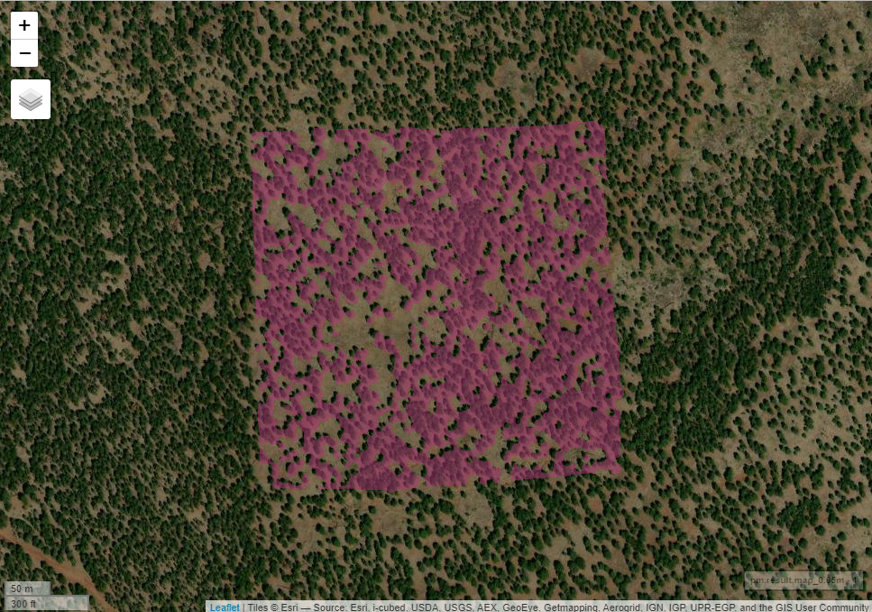

patchwoRk 
======================================================================================================
The patchwoRk package implements multiple patch delineation algorithms [at present it only implements 'PatchMorph' (Girvetz & Greco 2007), which can delineate patches across a range of spatial scales based on three organism-specific thresholds - (1) land cover density threshold, (2) habitat gap maximum thickness (gap threshold), and (3) habitat patch minimum thickness (spur threshold)].

### Read in a raster and produce a single suit-gap-spur outcome as a raster
Here is some description text
```r
library(patchwoRk)
# Example raster from Flagstaff (FUWI LEARN - 1.5-3 evidence-based restoration)
example.ras <- raster("./tifs/ClippedFUWI_1.5-3.tif")
# As in the original PatchMorph, the gap and spur values must be at least twice the cellsize
#-------0.5m ratser------------------------------
pm.result.map_0.05m <- patchMorph(data_in = example.ras, suitThresh = 1,
                            gapThresh = 4, spurThresh = 4)
mapview::mapview(pm.result.map_0.05m, 
                 col.regions=c("yellow", "transparent"), 
                 alpha=0.5, na.color = "transparent", 
                 legend = FALSE, 
                 maxpixels=1000000)
```


### Compute all suit-gap-spur combination outcomes as a raster
Here is some description text
```r
pm.layered.result.map <- patchMorph(data_in = example.ras, suitVals = c(0, 1, 2),
                                             gapVals = c(4, 20, 9), spurVals = c(4, 20, 9))
pm.layered.sum.map <- patchMorphSummary(pm.layered.result.map)
mapview::mapview(pm.layered.sum.map, 
                 col.regions=c("red", "transparent"), 
                 alpha=0.5, na.color = "transparent", 
                 legend = FALSE, 
                 maxpixels=1000000)
```


# Install `patchwoRk`
* Get the latest stable development version from github with
```r
devtools::install_github("bi0m3trics/patchwoRk")
```
To install the package from github make sure you have a working development environment.
* **Windows**: Install [Rtools.exe](https://cran.r-project.org/bin/windows/Rtools/).  
* **Mac**: Install `Xcode` from the Mac App Store.

# Changelog
point to <a href="https://github.com/bi0m3trics/patchwoRk/blob/master/NEWS.md">NEWS.md</a>
